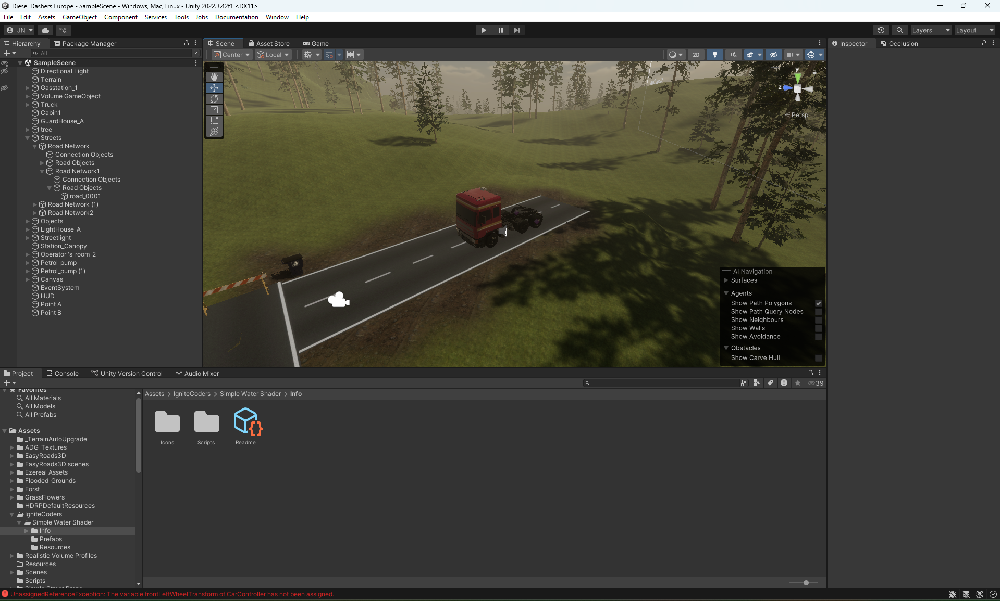

# 💡 IPERKA – Realize Truck

## 1. Adding a truck  
I tested different truck models. The one I chose was easy to use and looked very good.  
**Asset:** [Single Detailed Truck](https://assetstore.unity.com/packages/3d/vehicles/land/single-detailed-truck-895)

 
## 2. Camera and controls  
I added a camera and simple scripts to control the truck. I also tried other assets for driving, but they didn’t help much.
 
## 3. Making the truck stable  
The truck flipped over easily, so I changed the center of mass to make it more stable.
