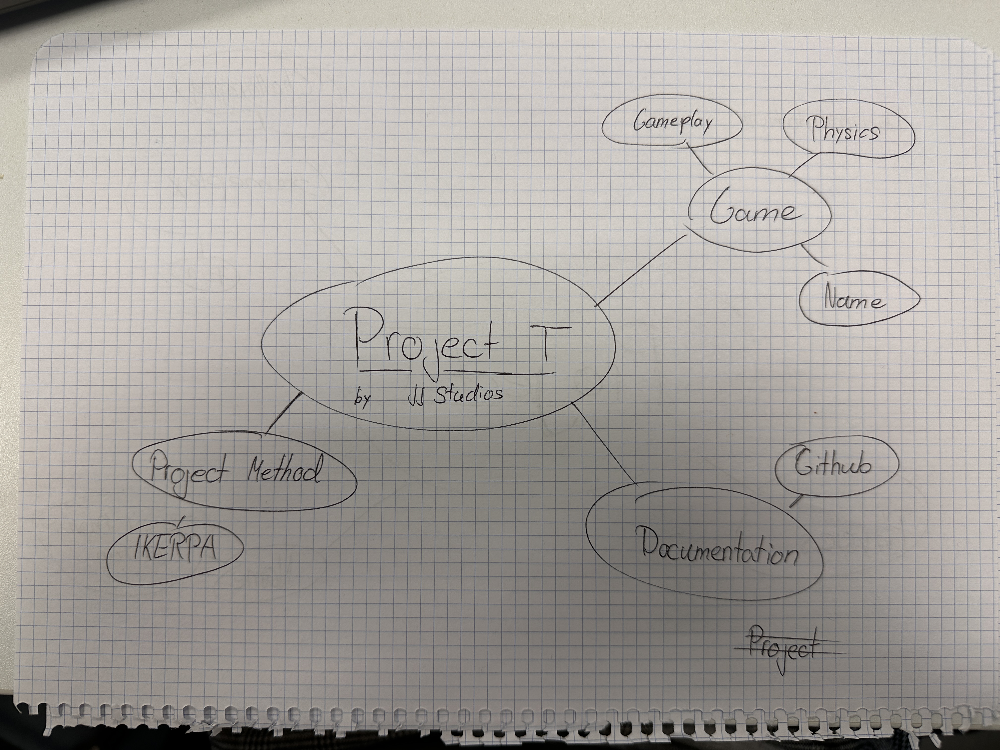

# How we planned this assignment

## Our Process
1. Brainstorm what our game should be about
2. A plan for my time management
3. My list of tasks to achieve my final goal

 ## Brainstorm
We had to find out what we want to do

Thats our Brainstorming map

 ## Resource Plan (Time)

* We created a resource plan to track out time
* We put our Avaible hours into our list. They are mostly the Same all the time
  [Time Schedule](../Planning/Time_Schedule.md)
* We have a total of 82 Hours wich doesnt sound much to be fair but its enough for a Team of 2
